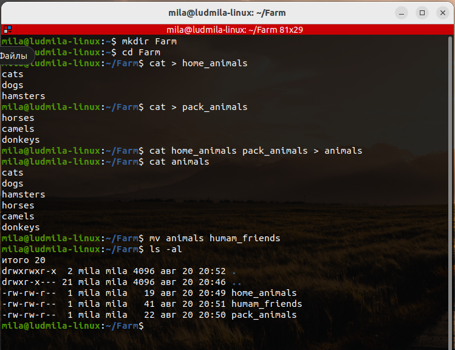
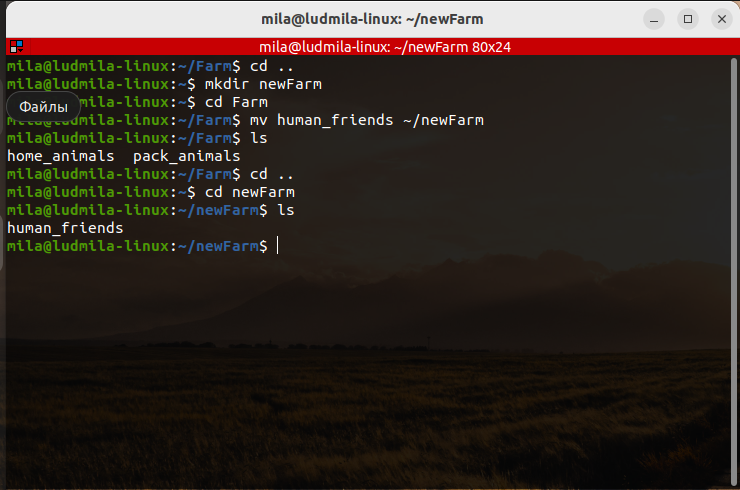
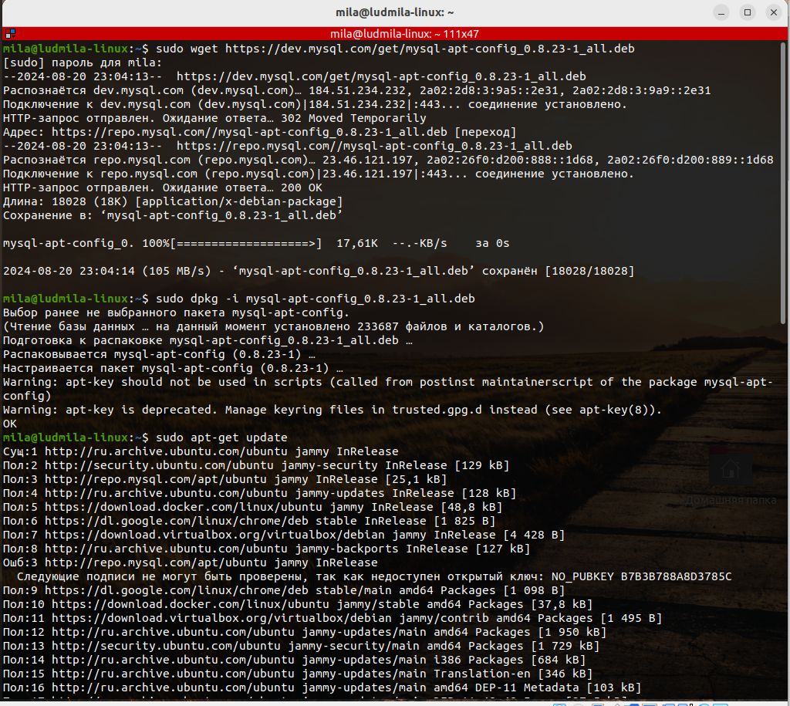
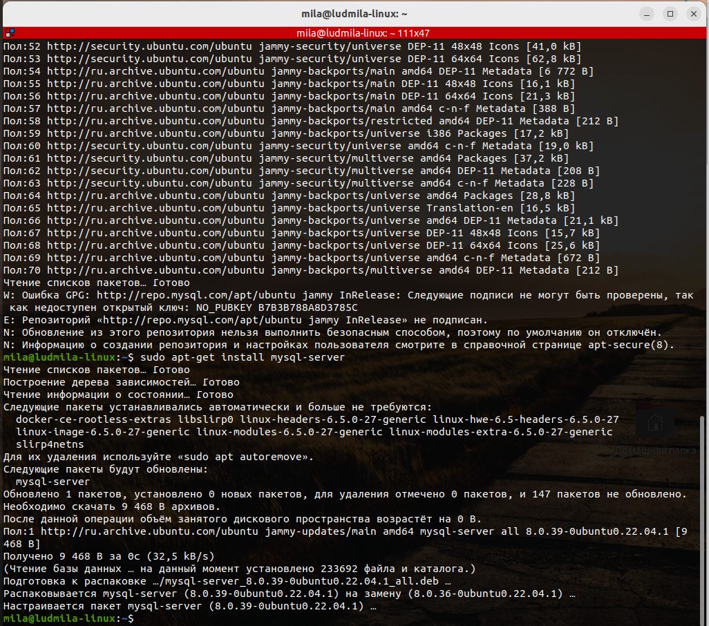
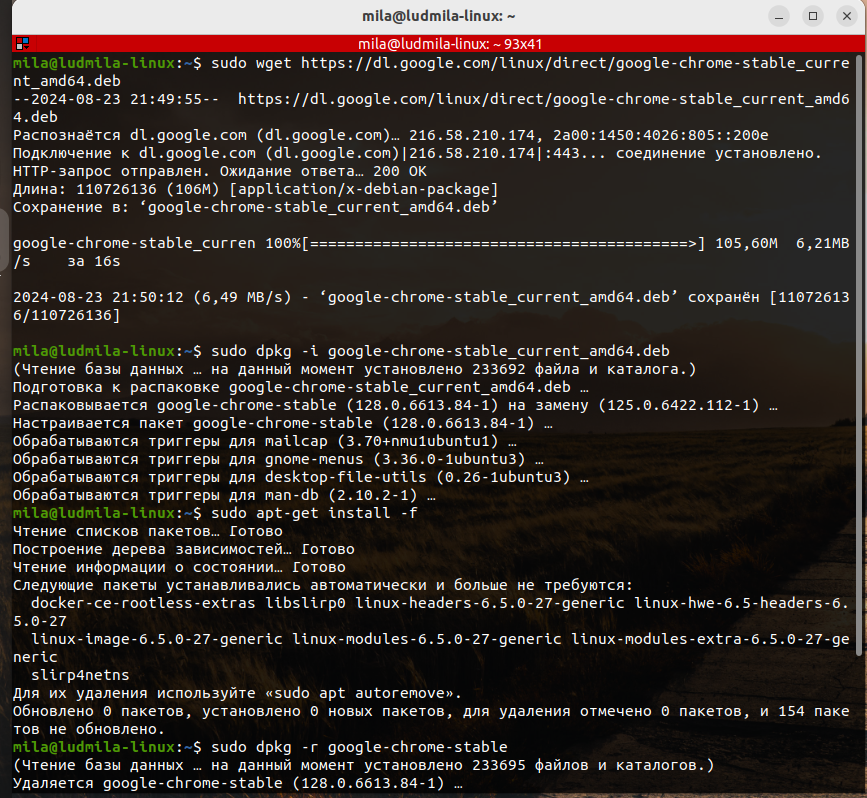

# Задание 1

mkdir Farm

cd Farm

cat > home_animals

cat > pack_animals

cat home_animals pack_animals > animals

cat animals 

mv animals human_friends

ls -al

# Задание 2

cd ..

mkdir newFarm

cd Farm

mv human_friends ~/newFarm

ls

cd ..

cd newFarm

ls

# Задание 3

sudo wget https://dev.mysql.com/get/mysql-apt-config_0.8.23-1_all.deb

sudo dpkg -i mysql-apt-config_0.8.23-1_all.deb

sudo apt-get update

sudo apt-get install mysql-server
cd Farm

# Задание 4

sudo wget https://dl.google.com/linux/direct/google-chrome-stable_current_amd64.deb

sudo dpkg -i google-chrome-stable_current_amd64.deb

sudo apt-get install -f

sudo dpkg -r google-chrome-stable

